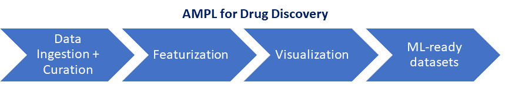

# AMPL-workshop-1

# NCI Data Science Learning Exchange Hands-on Tutorial: 
## *ATOM Modeling Pipeline (AMPL) for Drug Discovery*
*Presented by S. Ravichandran, Ph.D., BIDS, ATOM, Frederick National Laboratory for Cancer Research (FNLCR)*

 
 

In this workshop, we will demonstrate how to use Atom Modeling PipeLine (AMPL; https://github.com/ATOMconsortium/AMPL), a new, open-source conda-based software that automates key drug discovery steps. AMPL is designed to take molecular binding data (ex., IC50, ki, etc.) and carry out the Machine-Learning (ML) steps with minimal intervention. In this workshop, we will cover the topics listed in the figure shown above. Future workshops will cover the next steps (modeling, inference) in drug discovery.
The workshop on June 8 will include two parts, a short presentation followed by a hands-on tutorial. 

To begin: 
  
* Click, the "Open in COLAB" batch,![Open In Colab][https://colab.research.google.com/assets/colab-badge.svg](https://colab.research.google.com/github/ravichas/AMPL-workshop-1/blob/main/EDA_With_Harmonization_Using_AMPL.ipynb), to open the Google COLAB notebook

* If you have trouble with the previous step, click **EDA_With_Harmonization_Using_AMPL.ipynb** above to open the COLAB Notebook and click on the COLAB batch to view the live notebook.

## Supporting links

### AMPL Tutorials:
* https://github.com/ATOMconsortium/AMPL/tree/Tutorials/atomsci/ddm/examples/tutorials 
* https://github.com/ravichas/AMPL-Tutorial
* https://hpc.nih.gov/apps/ampl.html

### AMPL Publication 
* https://pubmed.ncbi.nlm.nih.gov/32243153/

### Similar chemoinformatics, drug-discovery software tools:
* DeepChem, https://deepchem.io/
* rdkit, https://www.rdkit.org/

### Chemoinformatics databases
* ChEMBL: https://www.ebi.ac.uk/chembl/
* PubChem: https://pubchem.ncbi.nlm.nih.gov/
* Drug Target Commons (DTC): https://drugtargetcommons.fimm.fi/
* ExCAPE-DB: https://solr.ideaconsult.net/search/excape/
* DrugBank: https://go.drugbank.com/

## Acknowledgements
* ATOM team

